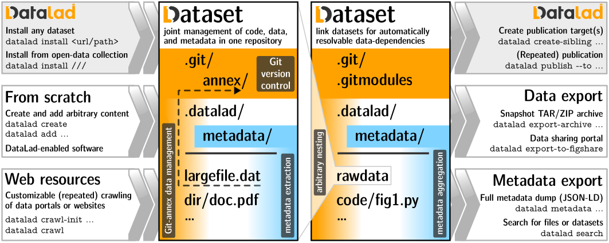

# Statement of Need

Code, data, and computing environments are at the core of scientific practice, and unobstructed access and efficient management of all those digital objects promotes scientific discovery through collaboration, reproducibility, and replicability. 
While code management and sharing is streamlined with the advance of software distributions, distributed version control systems, and social coding portals like GitHub, data has remained a “2nd-class citizen” in the contemporary scientific process, despite FAIR principles postulating demands on public data hosting portals and the big callout for Data Science.
Disconnected FAIR data hosting portals provide a cacophony of data access and authentication methods, data versioning is frequently ignored, and shared data provenance is often not recoverable simply because data management is rarely considered to be an integral part of the scientific process.

# Summary

The DataLad project (http://datalad.org) adapted the models of open-source software development and distribution to address technical limitations of today's data management, sharing, and provenance collection.
Born of idea to provide a unified data distribution for neuroscience, taking a versatile system for data logistics (git-annex (TODO: reference)) built on top of the most popular distributed version control system (git (TODO: reference)), and adopting ideas and procedures from software distributions, DataLad delivers a completely open, pioneering platform for flexible distributed research data management (dRDM).

`datalad` Python package provides both a Python library and a command line tool which expose core DataLad functionality to fulfill a wide range of dRDM use cases in any field of science.
Its API (see \autoref{fig:one}) operates on DataLad datasets which are just git (with optional git-annex for data) repositories with additional metadata and configuration.
 
Figure 1

Based on built-in mechanism of Git submodules, DataLad embraces and simplifies modular composition of smaller datasets into a larger (super)datasets.
With this simple paradigm, DataLad fulfills YODA principles (TODO) and facilitates efficient access, composition, scalability, reuse, sharing, and reproducibility of results.
As a testament of scalability, http://datasets.datalad.org provides a DataLad (super)dataset encapsulating thousands of datasets and providing a unified access to over 250 TBs of primarily neural data from a wide range of hosting portals. 

## Extensions

DataLad provides mechanism for providing domain or technology specific extensions.
Notable extensions at the moment are
- [datalad-container](https://github.com/datalad/datalad-container)
- [datalad-neuroimaging](https://github.com/datalad/datalad-neuroimaging)
The same mechanism is used for rapid development of new functionality to later be moved into the main DataLad codebase 
(e.g., [datalad-metalad](https://github.com/datalad/datalad-metalad/))

## Ecosystem

DataLad can be used as an independent tool, or as a core technology behind a larger platform.
[OpenNeuro](http://openneuro.org) uses DataLad for data logistics with data deposition to a public S3 bucket.
[CONP-PCNO](https://github.com/CONP-PCNO/) adopts aforementioned modular composition to deliver a rich collection of datasets with public or restricted access to data.
[ReproMan](http://reproman.repronim.org) integrates with DataLad to provide version control and data logistics 

TODO: site dRDM paper

## Datasets

DataLad datasets collections
- [http://datasets.datalad.org]() - a DataLad superdataset collating hundreds of datasets covering hundreds of TBs of largely neural data
- [https://github.com/datalad-datasets]() - interesting open data resources

## Documentation

DataLad core repository populates [docs.datalad.org](http://docs.datalad.org/en/latest/) with developers oriented information and detailed description of command line and Python interfaces. 
A comprehensive [DataLad Handbook](http://handbook.datalad.org) oriented toward novice and advanced users of all backgrounds is a separate project (https://github.com/datalad-handbook/).

## Development

`datalad` heavily relies on stability of underlying core tools - `git` and `git-annex`.
To guarantee 
Through its lifetime, DataLad project have been supporting development of `git-annex`.  

## Contributing

# Citations

Citations to entries in paper.bib should be in
[rMarkdown](http://rmarkdown.rstudio.com/authoring_bibliographies_and_citations.html)
format.

For a quick reference, the following citation commands can be used:
- `@author:2001`  ->  "Author et al. (2001)"
- `[@author:2001]` -> "(Author et al., 2001)"
- `[@author1:2001; @author2:2001]` -> "(Author1 et al., 2001; Author2 et al., 2002)"

# Acknowledgements

DataLad development was made possible thanks to support by 
NSF [1429999](http://www.nsf.gov/awardsearch/showAward?AWD_ID=1429999), 
[1912266](http://www.nsf.gov/awardsearch/showAward?AWD_ID=1912266) 
(PI: Halchenko) and BMBF 01GQ1411 and 01GQ1905 (PI: Hanke) 
through [CRCNS](https://www.nsf.gov/funding/pgm_summ.jsp?pims_id=5147) program.
It received significant contributions from ReproNim [1P41EB019936-01A1](https://projectreporter.nih.gov/project_info_details.cfm?aid=8999833&map=y) and DANDI [5R24MH117295-02](https://projectreporter.nih.gov/project_info_description.cfm?aid=9981835&icde=53349087) NIH projects. ... .

# References
