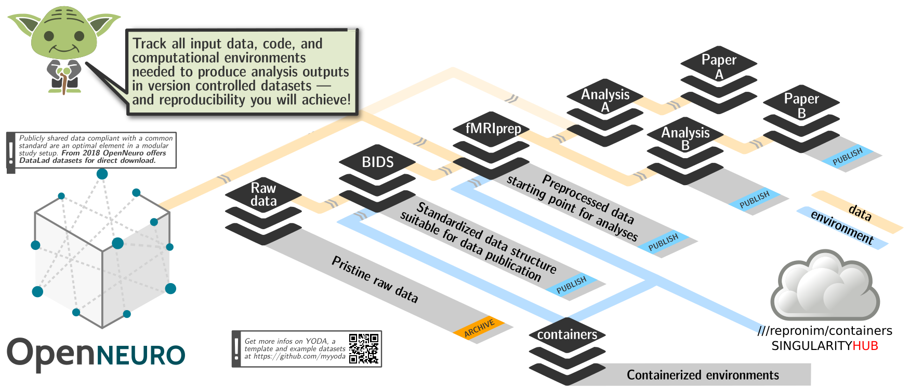

# Summary

... should include Statement of Need

## Modular composition

## Execution provenance tracking

## Documentation

[DataLad Handbook](http://handbook.datalad.org) provide novices and advanced users of all backgrounds with a guide through both the basics of DataLad and start-to-end use cases of specific applications. [docs.datalad.org](http://docs.datalad.org/en/latest/) provides developers oriented information and detailed description of command line and Python interfaces.

# DataLad Ecosystem

... should mention any past or ongoing research projects using the software and recent scholarly publications enabled by it.

## Extensions

DataLad provides mechanism for providing domain or technology specific extensions.
Notable extensions at the moment are
- [datalad-container](https://github.com/datalad/datalad-container)
- [datalad-neuroimaging](https://github.com/datalad/datalad-neuroimaging)
The same mechanism is used for rapid development of new functionality to later be moved into the main DataLad codebase 
(e.g., [datalad-metalad](https://github.com/datalad/datalad-metalad/))

## Integrations

[ReproMan](http://reproman.repronim.org) integrates with DataLad to provide
[OpenNeuro](http://openneuro.org) is using DataLad for data logistics with data deposited to a public S3 bucket.

## Datasets

DataLad datasets collections
- [http://datasets.datalad.org]() - a DataLad superdataset collating hundreds of datasets covering hundreds of TBs of largely neural data
- [https://github.com/datalad-datasets]() - interesting open data resources

# Citations

Citations to entries in paper.bib should be in
[rMarkdown](http://rmarkdown.rstudio.com/authoring_bibliographies_and_citations.html)
format.

For a quick reference, the following citation commands can be used:
- `@author:2001`  ->  "Author et al. (2001)"
- `[@author:2001]` -> "(Author et al., 2001)"
- `[@author1:2001; @author2:2001]` -> "(Author1 et al., 2001; Author2 et al., 2002)"

# Figures

Figures can be included like this: 

# Acknowledgements

DataLad development is supported in part by 
NSF [1429999](http://www.nsf.gov/awardsearch/showAward?AWD_ID=1429999), 
[1912266](http://www.nsf.gov/awardsearch/showAward?AWD_ID=1912266) 
(PI: Halchenko) and BMBF 01GQ1411 and 01GQ1905 (PI: Hanke) 
through [CRCNS](https://www.nsf.gov/funding/pgm_summ.jsp?pims_id=5147) program; 
ReproNim project NIH [1P41EB019936-01A1](https://projectreporter.nih.gov/project_info_details.cfm?aid=8999833&map=y).

# References